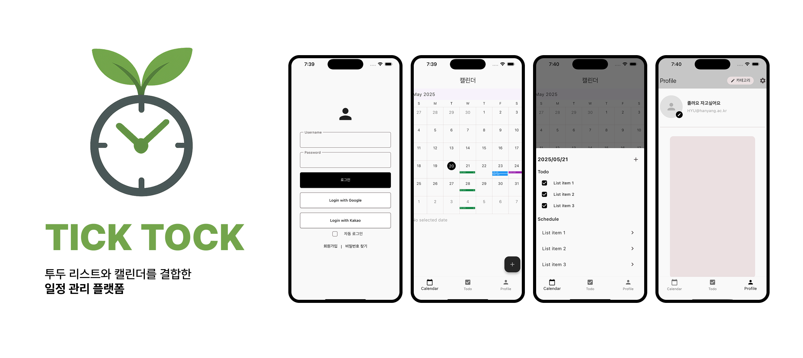

# tick_tock ⏰

저희 서비스는 **투두 리스트와 캘린더를 결합한 일정 관리 플랫폼**으로,   
개인과 그룹이 더욱 효율적으로 일정을 계획하고 조율할 수 있도록 돕는 것을 목표로 합니다.  
기본적으로 **투두 리스트와 캘린더를 연동하여 한눈에 일정과 할 일을 관리**할 수 있으며, **공유 일정 기능과 자동 추천 시스템**을 통해 **팀원, 친구, 가족 등과의 일정 조율을 간편하게 해결**할 수 있습니다.

## 조원 & 역할 👯‍♀️
| 이름 | 역할 |
|----|----|
|김승희| PM, 문서 관리, 프론트엔드 개발자 |
|정현도| 프론트엔드 개발자, 3D 렌더링 |
|정재민| 프론트엔드 개발자, 플러그인/패키지 통합 담당|
|김민서| 프론트엔드 개발자, 구글 OAuth 로그인 구현, 서버 인증 연동 및 세션 처리 담당|
|정유경| 백엔드 개발자, |

### Environment
  

### Config

### Development

### Front - 
### Back -   Postgress

### Communication
 

## 개발 일정
